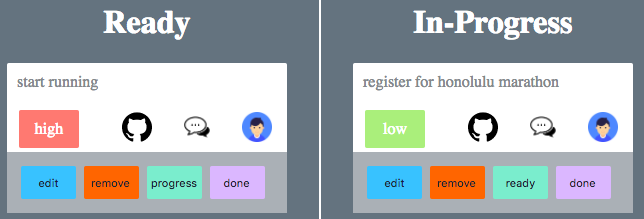

## KANBAN
[](https://github.com/facebookincubator/create-react-app)
[](https://www.devleague.com/)

* Team work makes the dream work, with strong communication and goal oriented planning. I built this web-app as a project submission during my JavaScript bootcamp at [DevLeague](https://www.devleague.com/).

# Kanban Screenshot:


# Features:
 - Admin & User views
 - Add new cards
 - HTML5 Drag & Drop
 - Delete/Edit Cards
 - Assign team members to cards
 - Analytics

# Getting Started:
```js
npm install
npm start
```

* Built with React & Redux - Mobile and Desktop Friendly

This project was bootstrapped with [Create React App](https://github.com/facebookincubator/create-react-app).